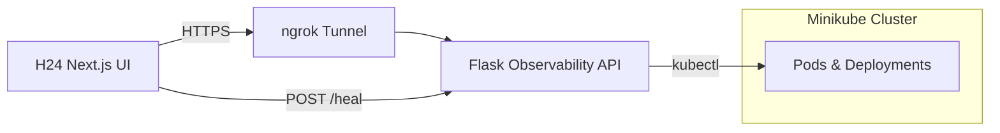

# Project Analysis – k8s-self-healing

## Overview

The **k8s-self-healing** repository provides a local development environment that demonstrates automated observability and self‑healing for Kubernetes workloads. It stitches together three main components:

1. **Flask Observability API (`app.py`)** – Exposes health, pod, and log information by querying the local cluster with `kubectl`. The API runs on port `5000`.
2. **ngrok Tunnel** – The start‑up script (`start-all.ps1`) spins up an ngrok tunnel to the Flask API, exposing a public HTTPS endpoint (`/pods`, `/health`, etc.).
3. **Next.js Dashboard (`h24-app`)** – A React/Next.js UI that consumes the ngrok‑exposed endpoints, visualises pod health, and can trigger healing actions (e.g., scaling deployments) via the API.

Together these pieces enable a **run‑book** where a developer can:
- Spin up a local Minikube cluster.
- Observe real‑time pod metrics through a web UI.
- Manually or automatically invoke remediation actions.

---

## Architecture Diagram



---

## Core Components

| Component | Path | Description |
|-----------|------|-------------|
| **Flask API** | `app.py` | Implements endpoints `/health`, `/pods`, `/logs/{namespace}/{pod}/{container}`. Handles Kubernetes queries, parses JSON, formats ages, extracts container details, and supports scaling deployments. |
| **Start‑up Script** | `start-all.ps1` | Launches the Flask server, starts ngrok tunnel, and prints local/remote URLs. |
| **Next.js Dashboard** | `h24-app/` | UI built with Next.js (React). Provides pages:
- `/dashboard/setup` – configure ngrok URL.
- `/dashboard/healing` – view pod list, triggers healing.
- API routes under `src/app/api/` for fetching pod data and invoking heal actions. |
| **Heal Logic** | `src/app/api/healing/decision-analysis/route.ts` (TS) | Calls the Flask endpoint to decide if a deployment needs scaling or other remediation. |
| **Observability Helpers** | `src/lib/observability/alerts.ts` (TS) | Contains TypeScript types and helper functions for alert payloads used by the UI. |
| **Utility Scripts** | `scripts/`, `setup‑supabase.*` | Additional tooling for data ingestion and optional Supabase integration (outside the core flow). |

---

## How to Run the Full Flow

1. **Start Minikube**
   ```powershell
   cd d:\k8s-self-healing
   minikube start
   ```
2. **Verify Pods**
   ```powershell
   kubectl get pods -A
   ```
3. **Start Observability API + ngrok**
   ```powershell
   .\start-all.ps1
   ```
   - The script prints two URLs:
     - `http://127.0.0.1:5000/health`
     - `https://<subdomain>.ngrok-free.app/pods`
4. **Launch the H24 Dashboard**
   ```powershell
   cd d:\k8s-self-healing\h24-app
   npm install
   npm run dev
   ```
   - Open `http://localhost:3000`.
5. **Configure ngrok URL**
   - Navigate to `http://localhost:3000/dashboard/setup`.
   - Add a name (e.g., `local‑minikube`) and paste the *ngrok* base URL from step 3.
6. **Validate End‑to‑End**
   - `curl http://127.0.0.1:5000/health`
   - `curl https://<subdomain>.ngrok-free.app/pods`
   - Verify the dashboard lists pods and shows health status.

---

## Healing / Self‑Recovery Logic

- The API includes helper functions to **scale deployments** (`_scale_deployment`).
- `decision-analysis` route evaluates pod health and determines if a deployment is unhealthy (e.g., zero available replicas, OOMKilled events).
- When healing is required, the UI sends a POST request to the Flask API which executes `kubectl scale deployment/<name> --replicas=<desired>`.
- Synthetic rows are generated for deployments with no pods to surface failures in the UI.

---

## Key Scripts & Commands

```powershell
# Start Minikube
minikube start

# List all pods
kubectl get pods -A

# Start Flask + ngrok (outputs URLs)
.\start-all.ps1

# Run the Next.js dashboard
cd h24-app
npm install
npm run dev
```

---

## Troubleshooting Highlights

- **Minikube fails to start** – Run `minikube delete` then `minikube start`.
- **kubectl cannot connect** – Run `kubectl config current-context` and `minikube update-context`.
- **ngrok URL not appearing** – Ensure ngrok is installed, authenticated, and restart `start-all.ps1`.
- **Dashboard reports invalid endpoint** – Use an HTTPS ngrok URL ending with `/pods`.

---

## Extensibility

- **Supabase Integration** – The repository contains optional Supabase schemas (`setup‑supabase.sql`, `setup‑supabase.js`). Those can be used to persist alert data.
- **Additional Observability** – Extend `app.py` with more kubectl queries (e.g., `top pod`, custom metrics) and expose new API routes.
- **CI/CD** – Wrap the start‑up steps in a CI pipeline to provision a temporary cluster for automated tests.

---

## Summary

`k8s-self-healing` is a **self‑contained lab** that demonstrates how to:
- Collect Kubernetes observability data programmatically.
- Expose it securely via an ngrok tunnel.
- Visualise and act upon that data through a modern web UI.
- Automate remediation such as scaling deployments based on pod health.

It serves as a learning platform for building observability‑driven self‑healing workflows in Kubernetes environments.
